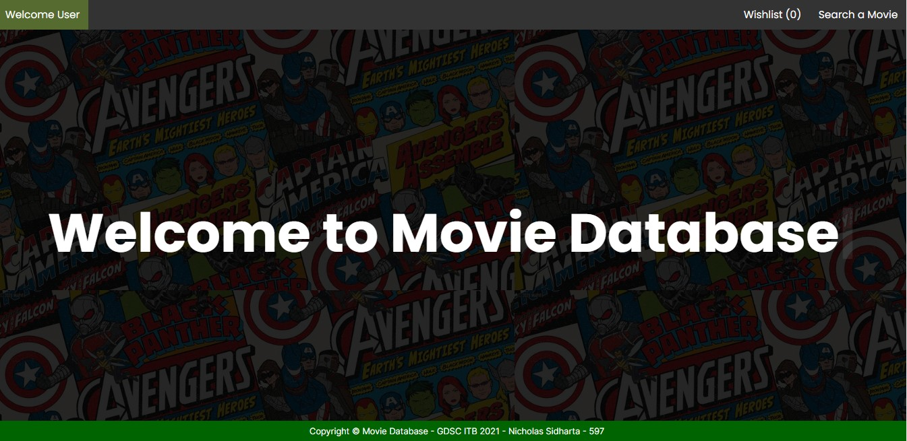
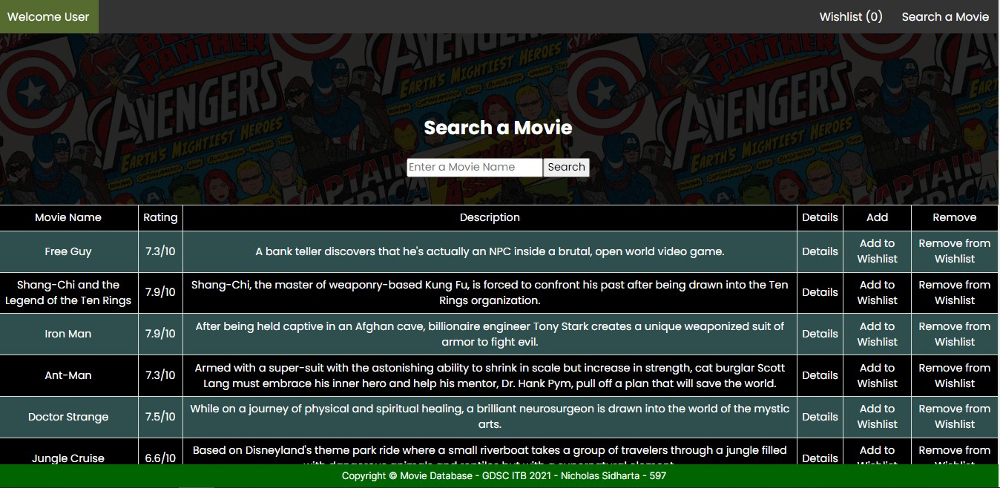
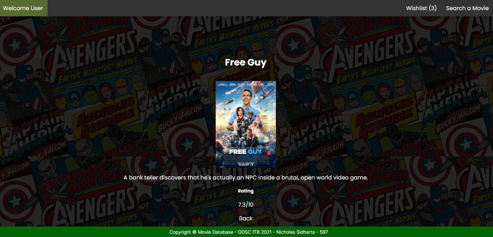
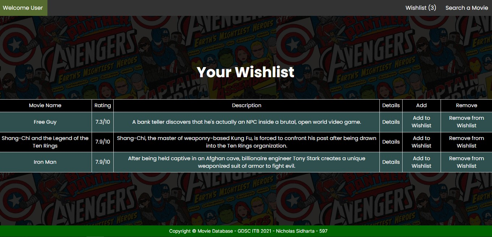

# GDSC-ITB-Front-End-Framework-React
## Nicholas Sidharta - 597

### Dashboard
#### Keterangan: Halaman yang pertama kali dimasuki oleh user pada saat membuka webpage tersebut dan berfungsi sebagai penyambut user

 

### Search & Overview
####  Keterangan: Halaman yang mendisplay semua movie dan juga untuk mencari movie yang ada pada list movie tersebut

 

### Details
#### Keterangan: Halaman yang dituju jika mengklik details pada dashboard page, menampilkan nama movie, deskripsi, rating, dan poster movie tersebut

 

### Wishlist
#### Keterangan: Halaman yang menampilkan semua movie yang user masukan kedalam daftar wishlist

